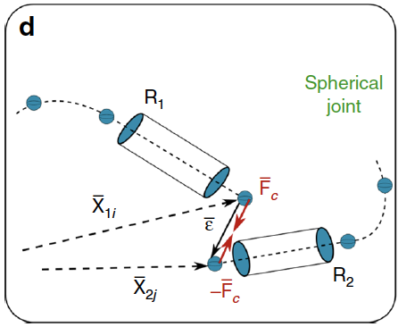
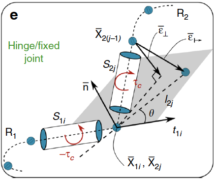
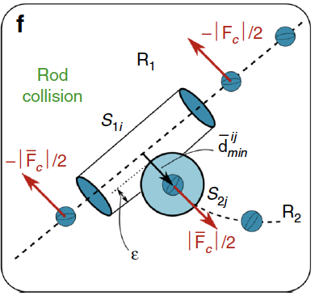

If you have multiple rods, it is important to properly define how they interact. This is done through the prescription of appropriate boundary conditions that couple the interactions of different rods as well as making sure that the rods do not intersect. There are any number of different ways you can define these interactions. Typically, we enforce these interactions through the application of correcting forces and torques which then cause the rods to satisfy the desired constraints. 

# Joints
When we define an interaction between nodes at the ends of two rods, we create a joint. The simplest joint we can create is a spherical joint where the rods are free to rotate and twist relative to each other. Additional constraints can also be added to restrict this movement such as limiting rotations of the rods to create a hinge joint or even fixing the relative positions of the rod to create a fixed joint. While in the description below we generally defined the correcting forces and torques as being applied to one of the rods ($R_2$) in reference to the position of another rod ($R_1$), it is important to note that the correcting forces and torques are applied to both rods, which can be seen by swapping the positions of $R_1$ and $R_2$ below. 

The correcting forces and torques that transformed into the local frame and stored in the external force $\mathbf{f}$ and external couple $\mathbf{c}$.

### Spherical Joint

A spherical joint is the simplest joint that can be defined. It is formed by specifying some displacement between the ends of two rods but not otherwise constraining the ability of the rods to rotate relative to each other. The joint is formed between the $i$ and $j$ nodes at the extremities of two rods $R_1$ and $R_2$ ($\mathbf{x}\_{1i}$ and $\mathbf{x}\_{2j}$). The distance between the two nodes is $\boldsymbol{\epsilon}=\mathbf{x}\_{2j}-\mathbf{x}\_{1i}$. An external force $\mathbf{F}\_\text{c}=k\boldsymbol{\epsilon}$ proportional to the distance $\boldsymbol{\epsilon}$ is applied to hold the ends of the rods together. Here the constant $k$ can be thought of as the joint stiffness.

If you instead want to define some fixed distance $\boldsymbol{\epsilon^0}$ between the ends of the rods you can simply modify the applied force to account for this offset $\mathbf{F}\_\text{c}=k(\boldsymbol{\epsilon} - \boldsymbol{\epsilon^0})$. 

### Hinge Joint

Building on the constraints that define a spherical joint, we can also restrict the rotation of the rods relative to each other to form an hinge joint where one of the rods ($R_2$) is restricted to rotation within a plane defined by the rod $R_1$. This constraint is enforced by considering the orientation of the end segments $S_{1i}$ and $S_{2j}$ of $R_1$ and $R_2$. The rotational plane of $R_2$ is defined as the plane with a normal vector $\mathbf{n}$ (chosen by you) that also contains $\mathbf{t}\_{1i}$, which is the tangent vector of $S_{1i}$. 

In order to keep the rod in this plane, a correcting torque $\boldsymbol{\tau}\_c$ is applied to $\mathbf{S}\_{2j}$. The correcting torque is proportional to the extent that the joint's neighboring node $\mathbf{x}\_{2(j-1)}$ is out of the rotation plane $\boldsymbol{\epsilon}\_{\perp} = - \left[\left(\mathbf{x}\_{2(j-1)}-\mathbf{x}\_{2j}\right) \cdot \mathbf{n}\right]\mathbf{n}$ leading to a torque of

$\boldsymbol{\tau}\_{\text{c}} = \left(\mathbf{x}\_{2(j-1)}-\mathbf{x}_{2j}+\boldsymbol{\epsilon}\_{\perp}\right) \times \left(k \boldsymbol{\epsilon}\_{\perp}\right)$.

Just like with the correcting force, you can think of the constant $k$ as being related to the stiffness of the hinge. 

### Fixed Joint

A fixed joint is similar to a hinge joint except now, instead applying a torque to keep the rod in the plane of rotation, you apply a correcting torque to keep the rod in the plane as well as oriented at some fixed angle $\theta$ relative to $S_{1i}$. A correcting torque is computed just like for a hinge joint but this time with the force proportional to the deviation from $\theta$

$\boldsymbol{\epsilon}\_{\mapsto} = \left[\mathbf{x}\_{2j} + l_{2j} \left(\mathbf{t}\_{1i}\cos\theta +\mathbf{b}\_{1i}\sin\theta \right)\right] - \mathbf{x}\_{2(j-1)}$.

Here, $l_{2j}$ is the length of $S_{2j}$ and $\mathbf{b}\_{1i}=\mathbf{n} \times \mathbf{t}\_{1i}$. 

# Rod Collision

If you have a system with multiple rods, it is important that they do not intersect or pass through each other. To avoid this intersection and to model contact between rods, we adapt the approach used for a single rod with self contact. Similar to the approach used to make a joint from two rods $R_1$ and $R_2$, we impose correcting forces $\mathbf{F}\_\text{c}$ on the contacting segments $S_{1i}$ and $S_{2j}$, which accounts for contact forces and also keeps the elements from intersecting.

The first step is to determine if any of the rods are even in contact. We compute the minimum distance $d_{\text{min}}^{ij}$ between two segments from $S_{1i}$ and $S_{2j}$ by parameterizing their centerlines $c_i(h) = s_i+h(s_{i+1}-s_i)$ so that 

$d_{\text{min}}^{ij}= \max\_{h_1,h_2\in[0,1]}\|\|c_i(h_1) - c_j(h_2)\|\|$. 

If $d_{\text{min}}^{ij}$ is less than the sum of the radii of the two segments, then they are in contact and penalty forces are applied to the nodes at each end of each segment as a function of the overlap $\epsilon_{ij} = (r_i + r_j - d_{\text{min}}^{ij})$, where $r_i$ and $r_j$ are the radii of segments $S_{1i}$ and $S_{2j}$. If $\epsilon_{ij}$ is smaller than zero, then the two edges are not in contact and no penalty is applied. 

Now that we know if any segment of the rod are in contact, we can apply correcting forces to the segments in contact. To do this, we define a unit vector $\mathbf{d}^{ij}\_{\text{min}}$ that points from the closest point of segment $S_{1i}$ to the closest point of segment $S_{2j}$. This allows us to define the contact force as

$\mathbf{F}\_\text{c}= H(\epsilon_{ij})\cdot\left[-k\epsilon_{ij}-\gamma\left(\mathbf{v}_i-\mathbf{v}_j\right)\cdot\mathbf{d}\_{\text{min}}^{ij}\right]\mathbf{d}\_{\text{min}}^{ij}$.

$H(\epsilon_{ij})$ is the Heaviside function, this ensures force is applied only if there is contact ($\epsilon_{ij}\ge0$). The first term in the square brackets is the response of the force to any intersection by the rods, while the second term models energy dissipation during contact  and is proportional the interpenetration velocity $\mathbf{v}_i-\mathbf{v}_j$. The coefficient $\gamma$ defines how much energy dissipation occurs during contact (think of knocking together two pool noodles vs two metal rods). 

## Joints and Rod Collision
Careful reading of this page may cause you to see a possible contradiction. If we define a spherical joint that joints rods $R_1$ and $R_2$, then wouldn't any rotation of $R_1$ relative to $R_2$ cause intersection of the segments closest to the joint? 

You are right, which means that our rod collision method needs to be slightly adapted to account for this case. 

## Useful References
Zhang, Chan, Parthasarathy, Gazzola **Modeling and simulation of complex dynamic musculoskeletal architectures**, Nature communications, 2019.

Gazzola, Dudte, McCormick, Mahadevan, **Forward and inverse problems in the mechanics of soft filaments**, Royal Society Open Science, 2018.  

A more complete list of publications about Cosserat rods may be found [here](../../4_publications/publications)

