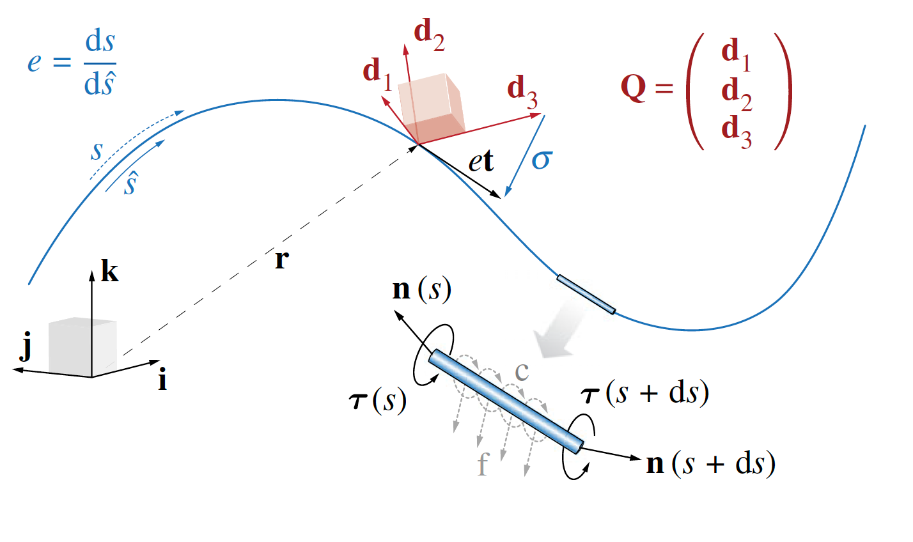

Discussion of what Cosserat rods are. What are the assumptions? What are some examples from nature of this systems? What is the history of them? 

## Cosserat Rod Theory

Cosserat rods can be mathematically described as a slender body with a centerline  $\bar{\mathbf{x}}(s, t) \in \mathbb{R}^3$ and rotation matrix $\mathbf{Q}(s, t)=\{ \bar{\mathbf{d}}_1, \bar{\mathbf{d}}_2, \bar{\mathbf{d}}_3 \}^{-1}$. This rotation matrix allows us to define a general relation between frames: $\mathbf{v}=\mathbf{Q}\bar{\mathbf{v}}$, $\bar{\mathbf{v}}=\mathbf{Q}^T \mathbf{v}$, where $\bar{\mathbf{v}}$ is a vector in the lab frame and $\mathbf{v}$ is a vector in the local frame.  

Here 

$s \in [0, L_0]$ is the material coordinate of a rod of rest-length $L_0$, 
$L$ denotes the deformed filament length and 
$t$ is time. 

If the rod is unsheared, 
$\bar{\mathbf{d}}_3$ points along the centerline tangent $\partial_s \bar{\mathbf{x}}=\bar{\mathbf{x}}_s$ 
while $\bar{\mathbf{d}}_1$ and $\bar{\mathbf{d}}_2$ span the normal--binormal plane. 

Shearing and extension shift $\bar{\mathbf{d}}_3$ away from $\bar{\mathbf{x}}_s$, which can be quantified with the shear vector $\boldsymbol{\sigma}=\mathbf{Q} (\bar{\mathbf{x}}_s-\bar{\mathbf{d}}_3) = \mathbf{Q}\bar{\mathbf{x}}_s - \mathbf{d}_3$ in the \emph{local} frame. 

The curvature vector $\boldsymbol{\kappa}$ encodes $\mathbf{Q}$'s rotation rate along the material coordinate $\partial_s \mathbf{d}_j = \boldsymbol{\kappa} \times \mathbf{d}_j$, while the angular velocity $\boldsymbol{\omega}$ is defined by $\partial_t \mathbf{d}_j = \boldsymbol{\omega} \times \mathbf{d}_j$. 

We also define the velocity of the centerline $\bar{\mathbf{v}} = \partial_t\bar{\mathbf{x}}$ and, 

In the rest configuration we define: 
* the bending stiffness matrix $\mathbf{B}$ 
* shearing stiffness matrix $\mathbf{S}$ 
* second area moment of inertia $\mathbf{I}$ 
* cross-sectional area $A$  
* mass per unit length $\rho$  

Then, the dynamics of a soft slender body is described by:

Linear Momentum: $\rho A \cdot \partial_t^2 \bar{\mathbf{x}} = \partial_s \left( \frac{\mathbf{Q}^T \mathbf{S} \boldsymbol{\sigma}}{e} \right) + e\bar{\mathbf{f}}$

Angular Momentum: $\small{\begin{align} \frac{\rho \mathbf{I}}{e} \cdot \partial_t \boldsymbol{\omega} = \partial_s \left( \frac{\mathbf{B} \boldsymbol{\kappa}}{e^3} \right) + &\frac{\boldsymbol{\kappa} \times \mathbf{B} \boldsymbol{\kappa}}{e^3} + \left( \mathbf{Q}\frac{\bar{\mathbf{x}}_s}{e} \times \mathbf{S} \boldsymbol{\sigma} \right) + \\\\ &\left( \rho \mathbf{I} \cdot \frac{\boldsymbol{\omega}}{e} \right) \times \boldsymbol{\omega} + \frac{\rho \mathbf{I} \boldsymbol{\omega}}{e^2} \cdot \partial_t e + e\mathbf{c} \end{align}}$

$e=\|\bar{\mathbf{x}}_s\|$.  is the local stretching factor, and $\bar{\mathbf{f}}$ and $\mathbf{c}$ are the external force and couple line densities, respectively \cite{Gazzola:2018}.

## Useful References
*Lays out Cosserat rod theory*: Gazzola, Dudte, McCormick, Mahadevan, **Forward and inverse problems in the mechanics of soft filaments**, Royal Society Open Science, 2018.  

Charles, Gazzola, Mahadevan, **Topology, geometry, and mechanics of strongly stretched and twisted filaments: solenoids, plectonemes, and artificial muscle fibers**, Physical Review Letters, 2019.  

A more complete list of publications about Cosserat rods may be found [here](../../4_publications/publications)