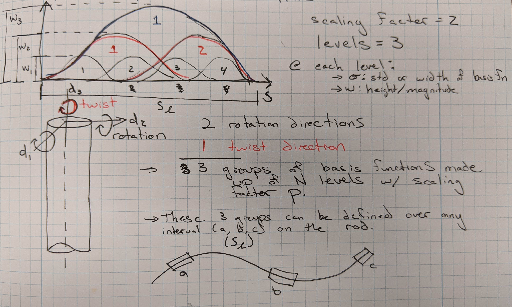

We define an interval $s\_\ell$ over which we want to apply a torque. There are two bending modes that are represented by the unit vectors $\mathbf{d}_1$ and $\mathbf{d}_2$ while a twisting mode is associated with $\mathbf{d}_3$. So over our interval $s\_\ell$ we need to define torques in these three different directions. The torque is represented as set of hierarchical radial basis function. Here we are using Gaussian basis functions. 

There are multiple levels of these basis functions, the number of which is defined by the number of levels $N$ and a scaling factor $p$. If $p=2$, then there is 1 basis function in the first level, 2 for the second lever, 4 for the third, 16 for the fourth etc. Generally the lower levels have larger magnitudes than the higher levels, meaning they represent bulk motion of the rod while the higher levels allow finer control of the rod along the interval. There is actually a biological basis for this hierarchy known as the size principle, see [here](https://en.wikipedia.org/wiki/Henneman%27s_size_principle) for more info. 

These basis functions can be mathematically represented as

$\boldsymbol{\tau}_k(s\_\ell) = \sum_j^N \sum_i^{k_j} H_n \ w_j \exp\left({-\frac{\|\mathbf{s}-\mu_n\|^2}{\sigma\_{j}^2}}\right)\mathbf{d}_k$

&nbsp;&nbsp;&nbsp;&nbsp;&nbsp;&nbsp;$\mathbf{d}_k$: unit vector for direction torque is applied. $k=1,2,3$ for the three bending modes. 

&nbsp;&nbsp;&nbsp;&nbsp;&nbsp;&nbsp;$N$: number of levels of basis functions

&nbsp;&nbsp;&nbsp;&nbsp;&nbsp;&nbsp;$p$: scaling factor determining growth of number of basis functions at each level.

&nbsp;&nbsp;&nbsp;&nbsp;&nbsp;&nbsp;$k_j=p^{(j-1)}$: number of basis functions at $j^{th}$ level according to the scaling factor $p$.

&nbsp;&nbsp;&nbsp;&nbsp;&nbsp;&nbsp;$w_j$: amplitude of all basis functions at the $j^{th}$ level.

&nbsp;&nbsp;&nbsp;&nbsp;&nbsp;&nbsp;$\sigma_{j}$: standard deviation of all basis functions at the $j^{th}$ level.

&nbsp;&nbsp;&nbsp;&nbsp;&nbsp;&nbsp;$n = j \ p^{(j-1)} + i$: index of $n_{th}$ basis function. 

&nbsp;&nbsp;&nbsp;&nbsp;&nbsp;&nbsp;$\mu_n$: location that $n^{th}$ basis function is centered at. Generally, functions at each level are equally spaced. 

&nbsp;&nbsp;&nbsp;&nbsp;&nbsp;&nbsp;$H_n$: a binary activation function for the $n^{th}$ basis functions. For a continuous case $H_n$ can also be a scaler. 

**To add**: brief description of API for making torques and discussion of size principle. 

### Creating torque profiles with hierarchical basis functions in Pyelastica

**Preliminaries**: We want to define torque profiles in three different directions to model the two modes of rotation (normal and binormal directions) and the twisting mode (tangent direction). This means we need to define three different torque profiles. This example will only setup one in the normal direction but the procedure in the same for the other two directions. 

To create the hierarchical basis set in one direction, we need to decide on how many hierarchical levels we want to have as well as the scaling factor for the hierarchy. We also need to define the magnitude and standard deviation of the basis functions at each level. Each level is defined by `RBF = ScalingFilter(Gaussian(sigma), w)` where `sigma` is the standard deviation and `w` is the magnitude. Then, to create a hierarchy we combine the basis sets together `Union(RBF1, RBF2, RBF3)` where the number of entries defines the number of levels of the hierarchy. It is important to note that the order matters, here `RBF1` will be the highest level basis set (i.e. one basis function) while `RBF3` will be the lowest level with the most basis functions in the set. Finally, we construct the basis functions using `SpatiallyInvariantSplineHierarchy(Union, scaling_factor)`. This can be done in one step. As an example:

    muscle_segment_normal = SpatiallyInvariantSplineHierarchy(
        Union(
            ScalingFilter(Gaussian(0.20), 10),  
            ScalingFilter(Gaussian(0.08), 8),
            ScalingFilter(Gaussian(0.05), 6),
        ),
        scaling_factor=2,
    )

Note that the higher level basis functions have larger standard deviations and magnitudes. 

The next step is to define the interval that the hierarchical basis set is active over. This is defined over the normalized length of the rod \[0,1\]

    begin = 0.01
    end = 0.40
    muscle_mapper_in_normal_dir = SpatiallyInvariantSplineHierarchyMapper(
        muscle_segment_normal, (begin, end)
    )

If we wanted to have multiple hierarchical basis sets active on different parts of the rod we can easily create these as `first_muscle_mapper_in_normal_dir` and `second_muscle_mapper_in_normal_dir`. Then, we need to combine them together

    segments_of_muscle_hierarchies_in_normal_dir = SplineHierarchySegments(
        first_muscle_mapper_in_normal_dir, second_muscle_mapper_in_normal_dir
    )

**note**: you still need to do this step even if you only have one hierarchical basis set.  

We have our hierarchical basis set but we need to define how we are going to activate it

**This part needs to still be implemented, how are we going to update the torques?**

Now it is time to apply the hierarchical basis set to the rod. To help us keep track of the what torques were applied during a simulation we define two recording arrays and the frequency that we wish to record in activations and torque profiles.

    # Set the list for activation function and torque profile
    activation_function_list_for_muscle_in_normal_dir = defaultdict(list)
    torque_profile_list_for_muscle_in_normal_dir = defaultdict(list)
    step_skip = 100

Next we apply the torque profile to the rod (here called `arm_muscle`) as a forcing

    # Apply torques
    arm_muscle.add_forcing_to(shearable_rod).using(
        HierarchicalMuscleTorques,                     # Type of force 
        segments_of_muscle_hierarchies_in_normal_dir,  # hierarchical basis set
        activation_func=two_segment_activation,        # activation function
        direction=normal,                              # direction of torques
        ramp_up_time=1.0,
        step_skip=step_skip,                           # how often to report torques
        activation_function_recorder=activation_function_list_for_muscle_in_normal_dir,
        torque_profile_recorder=torque_profile_list_for_muscle_in_normal_dir,
    )