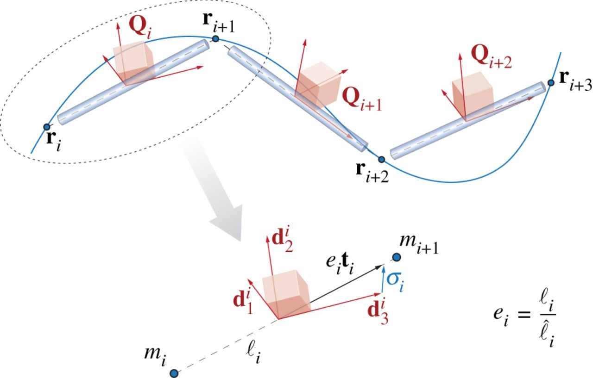

The [Theory](../single-rods) page laid out the continuum theory of Cosserat rods and presented the equations that need to be solved to model the dynamics and kinematics of the rods. In general, there is not always an analytical solution to these equations so we need to use numerical methods instead. We do this by discretizing the rod into a discrete set of nodes connected by straight line segments. Just as a continuum Cosserat rod is associated with a centerline $\mathbf{r}_i(t)$ and local coordinate frame $\mathbf{Q}_i(t)$, here the discretized Cosserat rod is defined by a collection of centerline vertices $\mathbf{r}_i(t)$ that are connected together by line segments associated with reference frames $\mathbf{Q}_i(t)$. 

There are three steps to solving this problem numerically.  
[1) Spatially discretize the continuum Cosserat rod equations](#spatial-discretization)  
[2) Select a time stepping algorithm](#time-discretization)  
[3) Specify your boundary conditions and interaction forces to model different physical effects.](#boundary-conditions-and-interaction-forces)  

## Spatial Discretization
We associate different quantities with the nodes and the segments. At the nodes, along with the position vector $\mathbf{r}_i$ there is also velocity $\mathbf{v}_i = \partial \mathbf{r}_i/\partial t$, the pointwise mass $m_i$ (**relate to $\rho$**), and any external forces applied to the node $\mathbf{F}_i$. There are `n+1` total nodes ($i=[1,n+1]$). The orientation of each segment is defined by the local reference frame $\mathbf{Q}_j(t)$ and is associated with an edge $\boldsymbol{\ell}_j = \mathbf{r}\_{j+1} - \mathbf{r}_j$ which has a current length $\ell_j = \|\boldsymbol{\ell}_j\|$, a reference length $\hat{\ell}_j = \|\boldsymbol{\hat{\ell}}_j\|$, a stretch ratio $e_j = \ell_j/\hat{\ell}_j$ and a unit tangent vector $\mathbf{t}_j = \mathbf{\ell}_j/\ell_j$. Because the segments lay between the nodes, there are `n` number of segments ($j=[1,n]$).

Along with these geometric properties we also assign a number of dynamical parameters to each segment. These are the shear/axial strain vector $\boldsymbol{\sigma}\_{j,\mathcal{L}} = \mathbf{Q}_j(e_j\mathbf{t}_j-\mathbf{d}_j^3)$, the angular velocity $\omega\_{j,\mathcal{L}}$, the reference cross sectional area of the segment $\hat{A}_j$, and the mass second moment of inertia, bend/twist matrix and shear/strain matrix of the segment ($\hat{\mathbf{J}}_j$, $\hat{\mathbf{B}}_j$, and $\hat{\mathbf{S}}_j$, respectively). Finally, the external couples applied to each segment are represented as $\mathbf{C}\_{j,\mathcal{L}}$.

In the continuum case, all quantities are defined point-wise, however, due to our discretization, it is better to represent some quantities, in particular the curvature $\hat{\boldsymbol{\kappa}}\_{i,\mathcal{L}}$, as integrated over some domain $\mathcal{D}$ along the rod. If we then divide the integrated quantity by the length of $\mathcal{D}$, it becomes equivalent to its point-wise average. We define a region $\mathcal{D}\_i$ at every *interior* node ($i=[2,n]$) as $\mathcal{D}_i = (\ell\_{i-1} + \ell\_i)/2$. This region is known as a Voronoi region. At each interior node we can then define the Voronoi domain at rest $\hat{\mathcal{D}}_i$ and a dilation factor for the domain $\mathcal{E}_i = \mathcal{D}_i/\hat{\mathcal{D}}_i$. Now we can define our curvature $\hat{\boldsymbol{\kappa}}\_{i,\mathcal{L}}$ and, as will be clear below, we also want to define a bend/twist matrix over a Voronoi region $\hat{\mathbf{\mathcal{B}}}_i$ as well

$\hat{\boldsymbol{\kappa}}\_{i,\mathcal{L}}=\frac{\log(\mathbf{Q}_i \mathbf{Q}\_{i-1}^T)}{\hat{\mathcal{D}}_i} \quad \text{and} \quad \hat{\mathbf{\mathcal{B}}}_i = \frac{\hat{\mathbf{B}}_i\ell\_{i} + \hat{\mathbf{B}}\_{i-1}\ell\_{i-1}}{2\hat{\mathcal{D}}_i}, \quad\quad i=[2,n]$. 

Now we have defined all the discretized quantities that we need and can write the spatially discretized form of the Cosserat rod's equations of motion

$\partial_t \mathbf{r}_i = \mathbf{v}_i \quad\quad i=[1,n+1]$

$\partial_t \mathbf{d}\_{j,k} = (\mathbf{Q}_j^T \boldsymbol{\omega}\_{j,\mathcal{L}}) \times \mathbf{d}\_{j,k} \quad\quad j=[1,n], \ k=1,2,3$

$m_i \cdot \partial_t \mathbf{v}_i = \Delta^h \left( \frac{\mathbf{Q}_j^T \hat{\mathbf{S}}_j \boldsymbol{\sigma}\_{j,\mathcal{L}}}{e_j} \right) + \mathbf{F}_i \quad\quad i=[1,n+1], \ j=[1,n]$

$\begin{align}\frac{ \hat{\mathbf{J}}_j}{e_j} \cdot \partial_t \boldsymbol{\omega}\_{j,\mathcal{L}} = &\Delta^h \left( \frac{\hat{\mathbf{\mathcal{B}}}_i \hat{\boldsymbol{\kappa}}\_{i,\mathcal{L}}}{\mathcal{E}_i^3} \right) + \mathcal{A}^h\left(\frac{\boldsymbol{\kappa}\_{i,\mathcal{L}} \times \hat{\mathbf{\mathcal{B}}}\_i \boldsymbol{\kappa}\_{i,\mathcal{L}}}{\mathcal{E}_i^3} \hat{\mathcal{D}}\_i \right)+\left( \mathbf{Q}\_j \mathbf{t}\_j \times \hat{\mathbf{S}}\_j \boldsymbol{\sigma}\_{j,\mathcal{L}} \right)\hat{\ell}_j + \\\\& \left( \hat{\mathbf{J}}_j \cdot \frac{\boldsymbol{\omega}\_{j,\mathcal{L}}}{e_j} \right) \times\boldsymbol{\omega}\_{j,\mathcal{L}}+\frac{\hat{\mathbf{J}}_j \boldsymbol{\omega}\_{j,\mathcal{L}}}{e_j^2} \cdot \partial_t e_j + \mathbf{C}\_{j,\mathcal{L}} \quad\quad j=[1,n], \ i=[2,n] \end{align}$

Here we use two special operators, the discrete difference operator $\Delta^h$ and the averaging operator $\mathcal{A}^h$. An important property of these operators is that they take $m$ points and return $m+1$ points, allowing consistency in the equations as written. 

Now that we have a method of discretizing the equations in space, we just need to implement a time stepper to evolve the equations. 

## Time Discretization
A number of different time stepping methods can be used to evolve our system. Our preferred method is a symplectic, second-order Verlet scheme. While this system of equations is in general not Hamiltonian, in the limit of $e\rightarrow1$ the system is equivalent to the classic Cosserat rod model which is Hamiltonian, justifying our use of a symplectic integrator. 

## Boundary conditions and interaction forces 
As with all differential equations, we need to specify appropriate initial and boundary conditions to allow us to solve the system. Generally speaking, we need to define initial conditions for position and velocity

$\mathbf{r}_i(t=0) = \mathbf{r}_i^0 \quad \text{and} \quad \mathbf{v}_i(t=0) = \mathbf{v}_i^0$.

We also often wish to specify a fixed point boundary condition for our rod to maintain definiteness $\mathbf{r}_0(t) = \mathbf{r}_0$.

Along with these conditions, we want to be able to include different physical effects which will allow us to model how our system interacts with a complex environment. A number of these physical interactions have been defined including internal dissipation, muscular activity, self-contact, interaction with solid bodies, static and kinematic friction and hydrodynamic forces. For details on these how these interaction forces are modeled, see Section 4 of [Gazzola et al (2018)](http://mattia-lab.com/wp-content/uploads/2018/06/Gazzola_RSOS_2018.pdf).

As a general strategy, we divide these interactions into external and internal interactions. The external interactions are accounted for by combining their contributions into the external forces and couples terms $\mathbf{F}$ and $\mathbf{C}\_{\mathcal{L}}$. Similarly, internal effects are directly added the the internal force and torque terms $\mathbf{n}$ and $\boldsymbol{\tau}\_{\mathcal{L}}$. 

<!--
#### Dissipation
Real materials have internal friction and viscoelastic losses which lead to energy dissipation. A simple method of modeling this dissipation is with Rayleigh potentials, which while not directly modeling the underlying mechanism, does an adequate job of representing the energy loss due to these friction effects. Viscous forces and torques per unit length ($\mathbf{f}_\nu$ and $\mathbf{c}\_\mathcal{L}$) are computed as linear function of the linear and angular velocities along with a constant representing the translations and rotational internal friction coefficients ($\gamma_t$ and $\gamma_r$)

$\mathbf{f}\_{\nu} = -\gamma_t \mathbf{v}$

$\mathbf{c}\_{\mathcal{L},\nu} = -\gamma_r \boldsymbol{\omega}\_\mathcal{L}$

Generally, we use a single dissipation constant such at $\gamma = \gamma_t = \gamma_r$.

#### Muscular activity

#### Self-contact

#### Interaction with solid boundaries

#### Friction

#### Hydrodynamics
-->

## Useful References
Gazzola, Dudte, McCormick, Mahadevan, **Forward and inverse problems in the mechanics of soft filaments**, Royal Society Open Science, 2018.  

A more complete list of publications about Cosserat rods may be found [here](../../4_publications/publications)