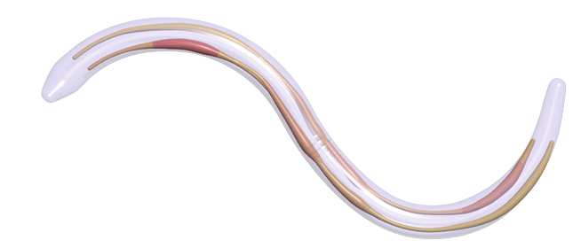

Welcome to the Cosserat rod project website. This website is dedicated to Cosserat rods and their numerical solution using the numerical package Elastica. 

This website is created and maintained by the mattiaLab at the University of Illinois at Urbana-Champaign. For more information on the projects we work on, see [mattia-lab.com](mattia-lab.com)

